# Despliegue y gestión de Gitea con Docker

El objetivo del proyecto es disponer de un servicio Git autohospedado (Gitea) que permita crear repositorios privados, gestionar usuarios y practicar flujos comunes de trabajo (branching, pull requests, merges) con datos persistentes y copias de seguridad.


## Fase 1. Preparación del servidor

En esta fase dejé el sistema listo y seguro para ejecutar contenedores Docker que alojarán Gitea.

- Actualicé el sistema operativo y dependencias para minimizar problemas de seguridad.
- Verifiqué las versiones de Docker.
- Configuré el firewall (firewalld/ufw según el caso) para permitir el tráfico necesario y bloquear lo demás.

Evidencias:

  
**Docker y Docker Compose instalados y verificados.**

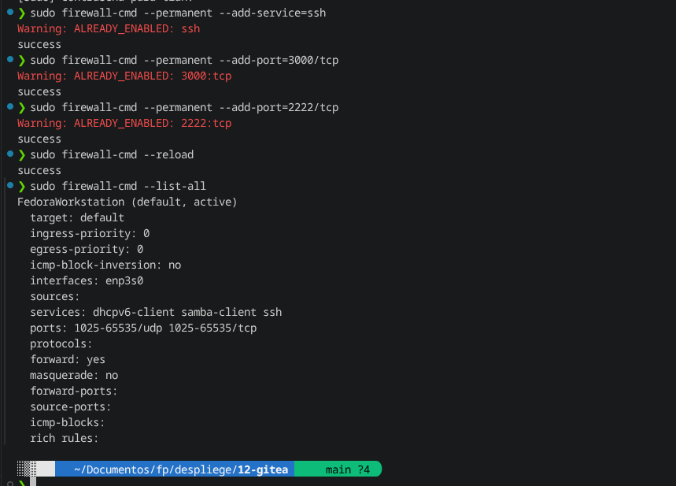  
**Puertos 3000/tcp y 2222/tcp abiertos para Gitea (web y SSH Git).**


## Fase 2. Despliegue de Gitea con Docker

Se levantó Gitea de forma reproducible usando Docker Compose y garanticé persistencia de datos.

- Definí un `docker-compose.yml` con volúmenes para la base de datos y los datos de Gitea.
- Publiqué los puertos necesarios (3000 para la interfaz web y 2222 para SSH git).
- Arranqué los servicios y confirmé que los contenedores subieron sin errores.


Evidencias:

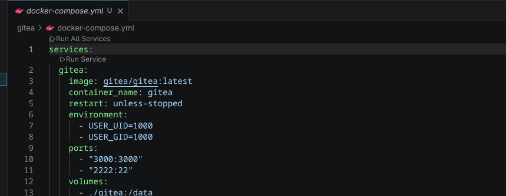  
**Contenido del archivo docker-compose.yml que define el servicio de Gitea.**

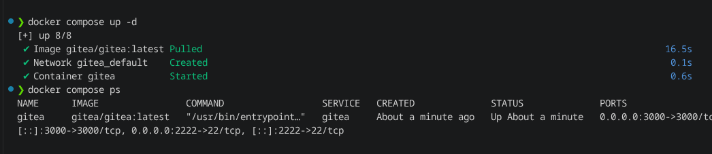  
 **Salida de `docker-compose up` y estado del contenedor.**

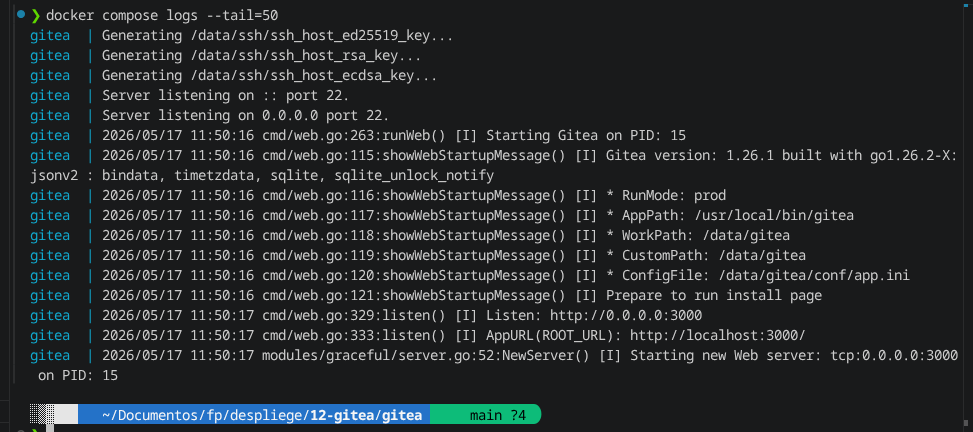  
**Logs iniciales del contenedor para comprobar que la aplicación arrancó correctamente.**


## Fase 3. Configuración inicial de Gitea

Se completó la configuración web de Gitea, crear cuentas y ajustó parámetros básicos (base de datos, SSH, correo opcional).

- Accedí a la interfaz web en `http://192.168.1.175:3000` y rellené el formulario de instalación.
- Configuré la base de datos y la ubicación de los datos.
- Creé un usuario administrador y usuarios normales para pruebas.

Evidencias:

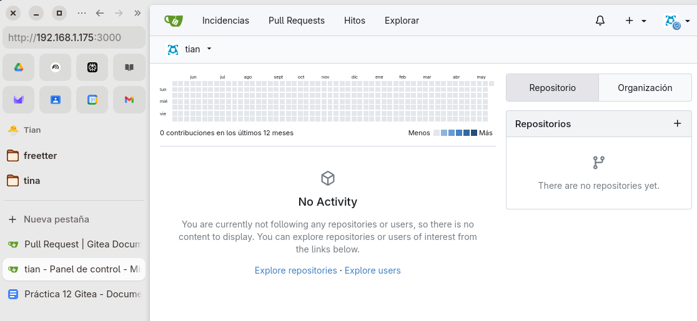  
**Vista del instalador web.**

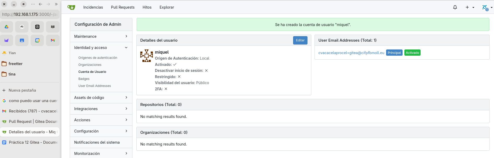  
**Ejemplo de usuario creado desde el panel.**

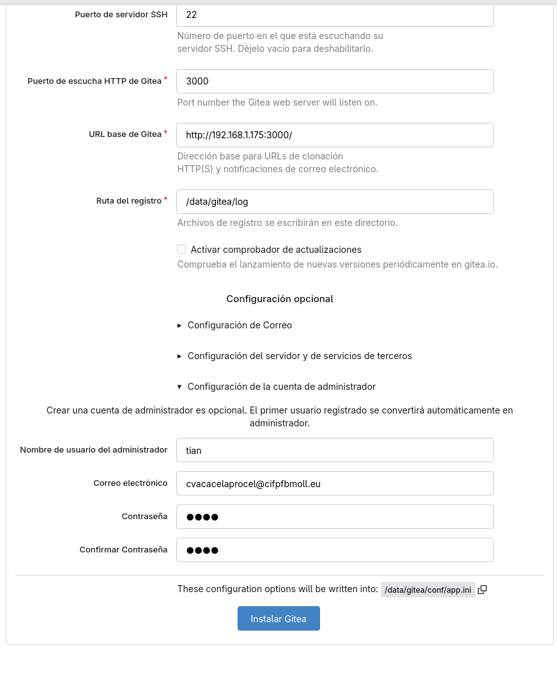  
**Repositorio practica-gitea marcado como privado.**

## Fase 4. Subida del proyecto local

Se conectó un repositorio local con el servidor Gitea y subí un proyecto mínimo para verificar el flujo Git remoto.

- Cloné el repositorio vacío desde Gitea o inicialicé el repositorio local con `git init`.
- Añadí `index.html`, `style.css` y el `README.md` y realicé commits.
- Configuré el remoto con la URL SSH/HTTPS provista por Gitea y ejecuté `git push`.

Evidencias:

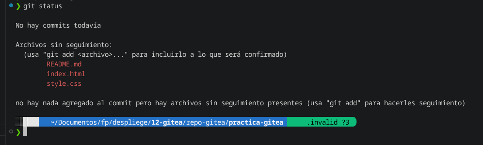  
**stado antes del commit.**

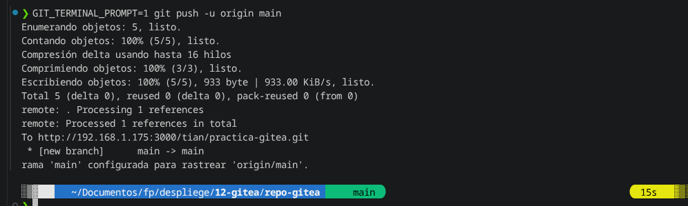  
**Push del primer commit al repositorio remoto.**

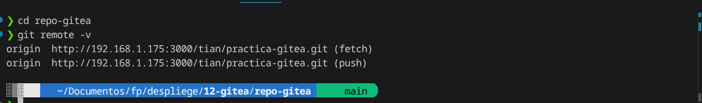  
**Configuración del remoto apuntando a Gitea.**

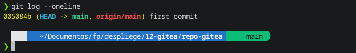  
**Historial de commits en local.**

## Fase 5. Ramas, Pull Request y merge

- Creé una rama de trabajo (`mejora-readme`).
- Realicé cambios y la subí al remoto.
- Abrí un Pull Request desde `mejora-readme` hacia `main` y lo fusioné desde la interfaz.

Evidencias:

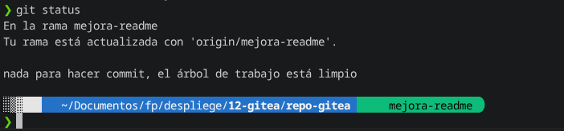  
**Rama publicada.**

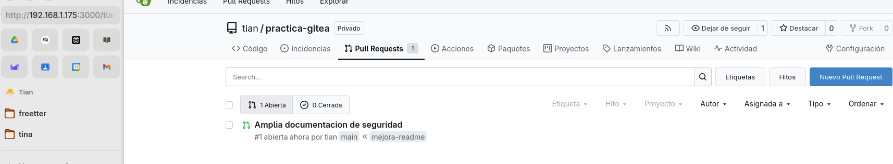  
**PR abierto desde la interfaz.**

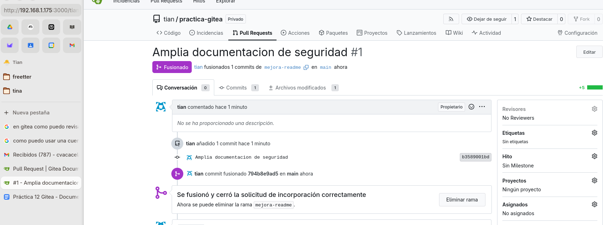  
**PR fusionado.**

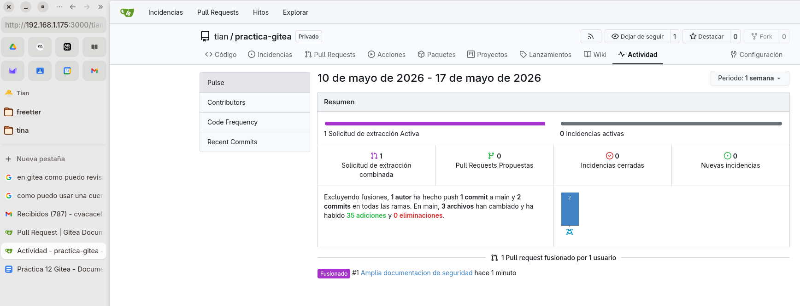  
**Historial con los commits fusionados.**

## Fase 6. Seguridad y documentación final

- Verifiqué que los contenedores y servicios estén activos.
- Revisé las reglas del firewall y la integridad de los volúmenes de datos.
- Realicé una copia de seguridad básica del directorio `gitea/`.

Evidencias:

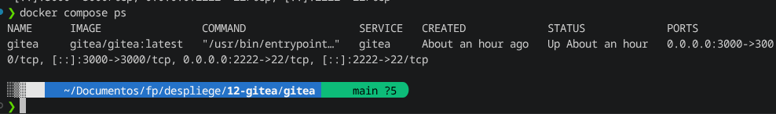  
**Contenedor Gitea en ejecución.**

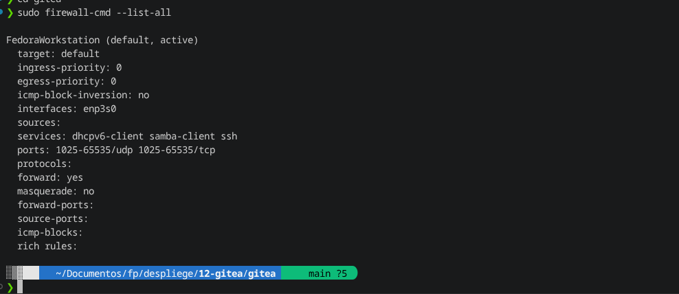  
**Reglas finales del firewall.**

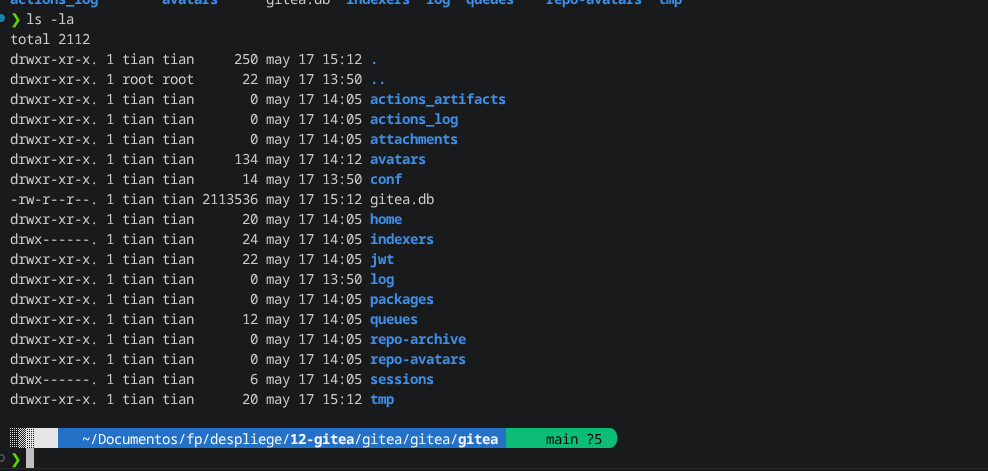  
**Estructura del directorio de datos persistentes.**

## Puertos utilizados
- 3000/tcp: interfaz web de Gitea
- 2222/tcp: SSH para operaciones Git

## Persistencia de datos

Los datos de Gitea (repositorios, usuarios, configuraciones) se almacenan en el directorio `gitea/` del proyecto. Si se elimina este directorio sin copia de seguridad, se perderá la información.

## Copia de seguridad básica

Comando usado para backup completo del directorio de datos:

```bash
sudo tar -czf backup-gitea.tar.gz gitea
```


## Tabla de resumen

| Usuario | Rol   | Repositorio   | Visibilidad | URL del servicio           | Puertos              |
|--------|-------|----------------|-------------|----------------------------|----------------------|
| tian   | Admin | practica-gitea | Privado     | http://192.168.1.175:3000  | 3000/HTTP, 2222/SSH  |
| alumno | Normal| practica-gitea | Privado     | http://192.168.1.175:3000  | 3000/HTTP, 2222/SSH  |

---

